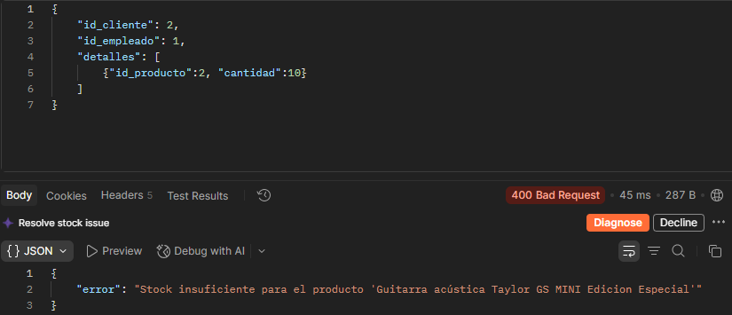
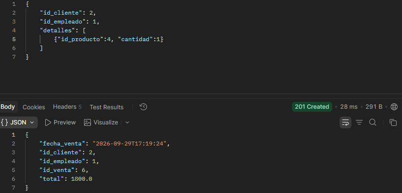

# Sistema de ventas e inventario - Instrumentos Melodika

---

## Avances de primera entrega

> [!IMPORTANT]
> Aún no hay interfaz disponible, trabajando solo backend

- Diagrama ER y Caso de Uso
- Conexión con MYSQL
- Modelos creados
- APIs creadas
- Datos iniciales creados: **10 productos - 10 inventarios (1 por producto)**, **2 clientes**, **1 empleado**

### Alerta de stock insuficiente

Con Postman se intento crear una venta añadiendo más productos de lo disponible en stock, **respuesta**:

### Creación de venta

Se creó una venta con postman

> [!IMPORTANT]
> **Para dashboard administrativo**:
> Terminar el CRUD para los modelos necesarios y crear/generar las recomendaciones.