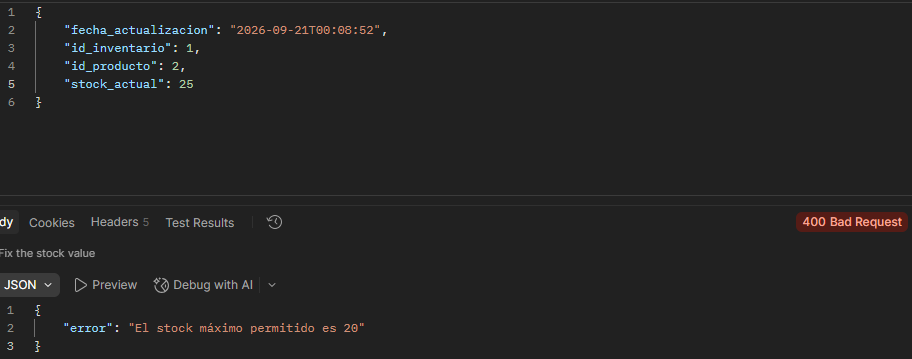
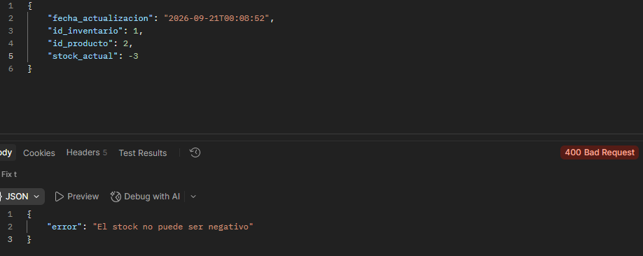
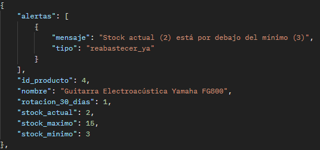
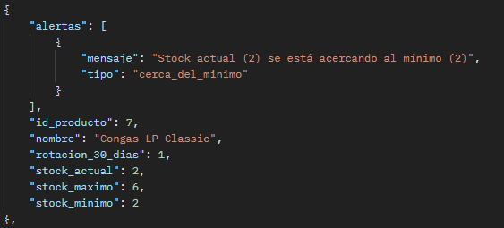
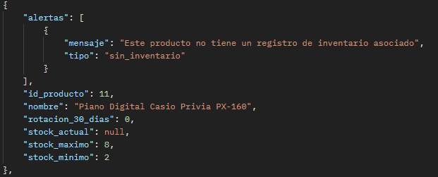

# Sistema de ventas e inventario - Instrumentos Melodika

---

## Avances de primera entrega

> [!IMPORTANT]
> Aún no hay interfaz disponible, trabajando solo backend

- Diagrama ER y Caso de Uso
- Conexión con MYSQL
- Modelos creados
- APIs creadas
- Datos iniciales creados: **10 productos - 10 inventarios (1 por producto)**, **2 clientes**, **1 empleado**

---

## Validaciones

### Alerta de stock insuficiente

Con Postman se intento crear una venta añadiendo más productos de lo disponible en stock, **respuesta**:

### Alerta de stock máximo

Se intento actualizar el stock de un producto con una cantidad mayor al stock maximo, **respuesta**:

### Alerta de stock negativo

Se intento actualizar el stock de un producto con una cantidad negativa **respuesta**:

---

## Recomendaciones

Reabastecer producto cuando el **stock_actual < stock_minimo**.

Si el **stock_actual** esta cerca (margen de advertencia: 30%) o igual al **stock_minimo**.

Si el producto no tiene registro en inventario, entonces **avisar_producto_sin_inventario**

---

### Creación de venta

Se creó una venta con postman

> [!IMPORTANT]
> **Interfaz dashboard administrativo**:
> Mostrar y manipular el CRUD para los modelos necesarios y crear la vista de recomendaciones.